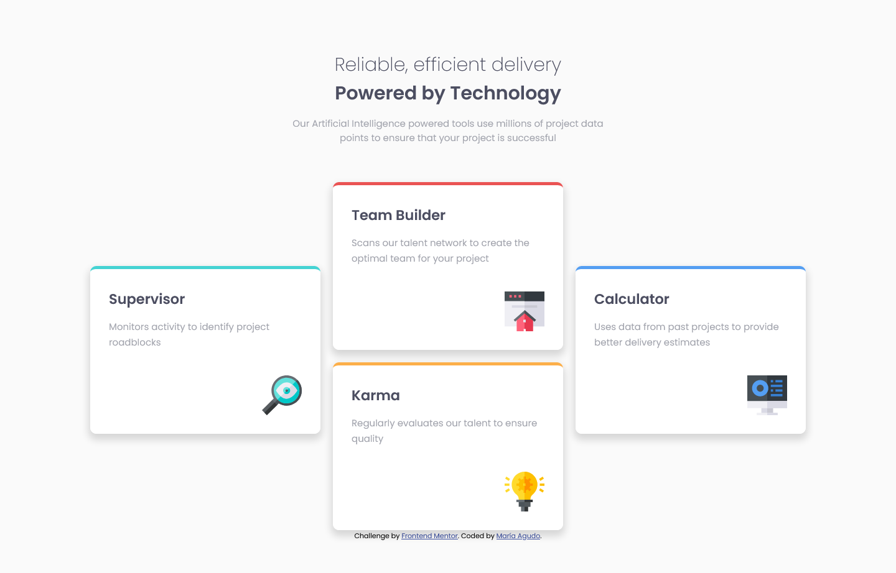
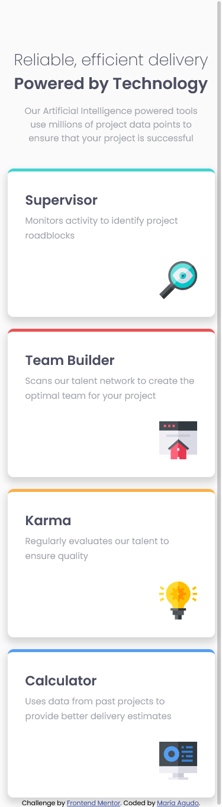

# Frontend Mentor - Four card feature section solution

This is a solution to the [Four card feature section challenge on Frontend Mentor](https://www.frontendmentor.io/challenges/four-card-feature-section-weK1eFYK). Frontend Mentor challenges help you improve your coding skills by building realistic projects. 

## Table of contents

  - [The challenge](#the-challenge)
  - [Screenshot](#screenshot)
  - [My process](#my-process)
  - [Built with](#built-with)
  - [What I learned](#what-i-learned)
  - [Continued development](#continued-development)
  - [Useful resources](#useful-resources)
  - [Author](#author)

### The challenge

Users should be able to:

- View the optimal layout for the site depending on their device's screen size

### Screenshot

## My process

I kept it simple and didn't complicate things in the way the divs were positioned, so I just did it in an easy way and didn't add too much divs... UPDATE: I had to add that extra div in order to make my design better. I used flex instead of hard coding some margins and I added @media so it looks better and responsive.

### Built with

- Semantic HTML5 markup
- CSS custom properties
- Flexbox
- CSS Grid

### What I learned

This was a challenge to practice. I'm getting more confident in every challenge.

### Continued development

I need to learn Mobile First design!!!

### Useful resources

- [W3schools](https://www.w3schools.com) - This helps me every time I code.

## Author

- Github - [María Agudo](https://github.com/mdagudo)
- Frontend Mentor - [@mdagudo](https://www.frontendmentor.io/profile/mdagudo)
